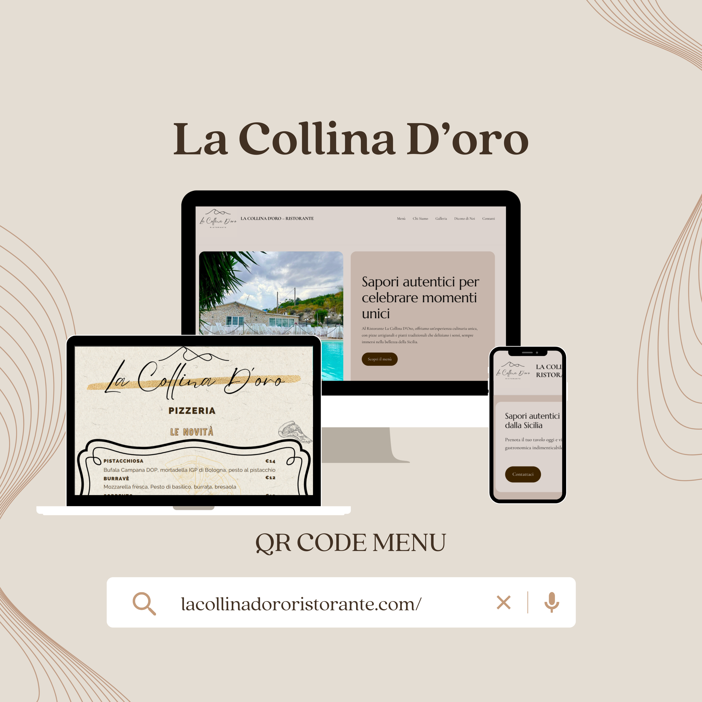

# 🍽️ La Collina d'Oro - Sito Web Ufficiale

Benvenuti nel repository ufficiale del tema WordPress custom per il ristorante **La Collina d'Oro**. Questo progetto è stato sviluppato per offrire un'esperienza digitale elegante, veloce e orientata alla facilità di consultazione del menù e delle prenotazioni.

---

## 📸 Anteprima del Progetto

*Rappresentazione visiva del design responsive su diversi dispositivi.*

---

## ✨ Funzionalità Principali

* **Design Custom a Blocchi**: Sviluppato utilizzando le tecnologie più recenti di WordPress (Full Site Editing).
* **Menù Digitale Dinamico**: Gestione semplificata delle portate direttamente dal pannello admin.
* **Integrazione Menù PDF**: Caricamento e visualizzazione del menù cartaceo in formato PDF per una consultazione rapida [Download Menù](assets/menu.pdf).
* **Performance Ottimizzate**: Asset leggeri e codice pulito per un caricamento istantaneo.
* **Mobile First**: Ottimizzazione specifica per smartphone, ideale per i clienti che cercano il ristorante in mobilità.

---
## 📖 Il Menù: Esperienza Digitale & PDF
Per La Collina d'Oro ho curato un'esperienza di consultazione del menù a due livelli, pensata per ogni tipo di cliente:

* **Menù Digitale Integrato**: Realizzato direttamente con i blocchi nativi di WordPress per garantire una lettura perfetta da smartphone, con testi leggibili e caricamento immediato.
* **Versione PDF Professionale**: Ho realizzato e integrato una versione PDF scaricabile, ottimizzata per la stampa e per chi desidera una consultazione offline fedele all'identità visiva del ristorante.
    * **User Experience**: Il link al PDF è posizionato strategicamente nell'header e nel footer per un accesso rapido.
    * **Ottimizzazione**: Il file è stato compresso per garantire il massimo della qualità grafica con il minimo peso in KB.

---
## 🛠️ Tecnologie Utilizzate

* **CMS**: WordPress 6.x
* **Architettura**: Block Theme (FSE)
* **Configurazione**: JSON-based styling via `theme.json`
* **Assets**: Immagini ottimizzate e icone vettoriali

---

## 📂 Struttura del Repository

* `/assets`: Immagini, font e il **Menù in formato PDF**.
* `/templates`: Struttura delle pagine principali.
* `/parts`: Componenti riutilizzabili come Header e Footer.
* `theme.json`: Definizioni globali di stile (colori, tipografia).

---

© 2026 Ristorante La Collina d'Oro. Tutti i diritti riservati.
